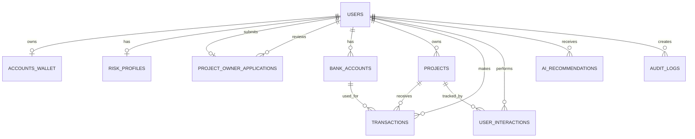
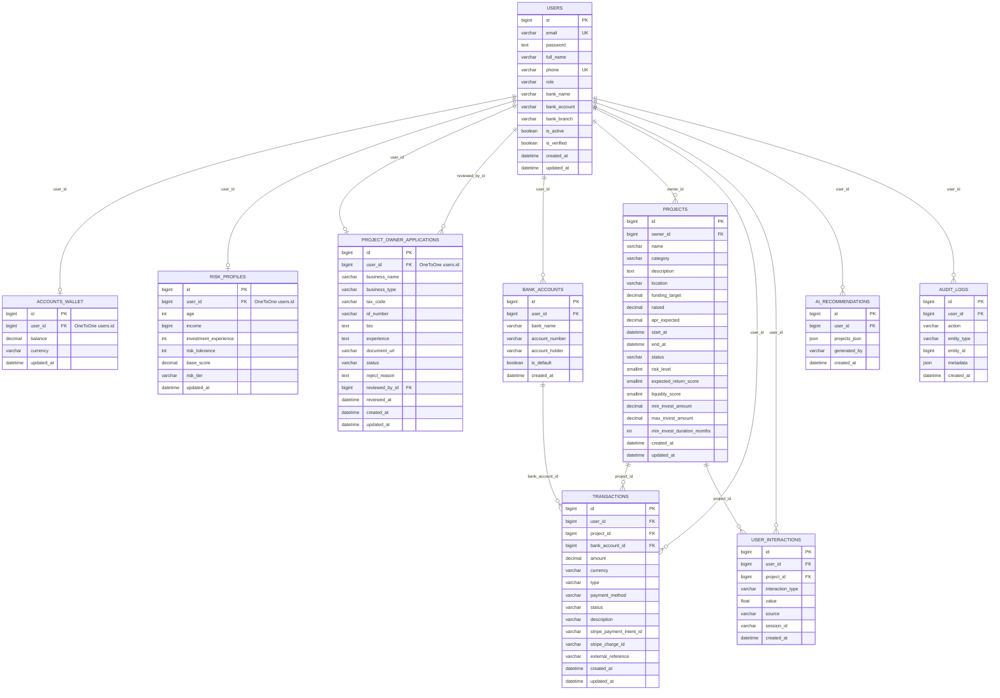

# Database ERD

Tai lieu nay duoc tong hop tu cac Django models trong project.

## ERD tong quan

## Schema chi tiet

## Ghi chu quan he

- `users` la bang trung tam cua he thong.
- `accounts_wallet`, `risk_profiles`, `project_owner_applications` la quan he 1-1 voi `users`.
- `projects.owner_id` tro toi `users.id`, the hien chu du an.
- `transactions.user_id` la nguoi thuc hien giao dich.
- `transactions.project_id` co the null vi nap/rut tien khong nhat thiet gan voi du an.
- `transactions.bank_account_id` co the null vi khong phai moi giao dich deu dung tai khoan ngan hang.
- `project_owner_applications.reviewed_by_id` tro toi admin/user duyet ho so va co the null.
- `audit_logs.entity_type` va `entity_id` la tham chieu logic, khong phai foreign key that.
- Django se tu tao them cac bang phu cho quyen/nhom cua `PermissionsMixin`, vi vay ERD tren tap trung vao domain models cua project.
